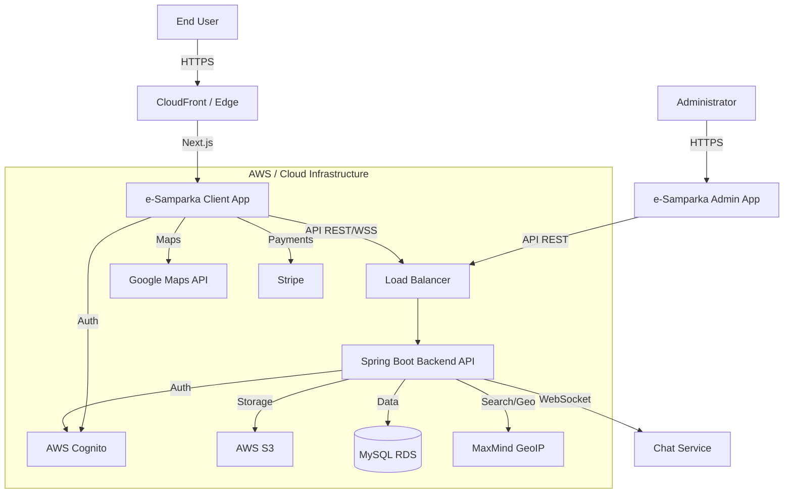

# System Architecture & Overview

## 1. Executive Summary

**e-Samparka** is a comprehensive multi-service platform designed to connect users with various services such as Real Estate, IT Training & Placement, Event Ticketing, and Social Networking. The system is built using a modern, scalable architecture featuring a Spring Boot backend, a Next.js frontend, and a dedicated Admin portal, all backed by robust AWS infrastructure.

## 2. Target Customer & User Base

*   **General Users**: Individuals looking for services like renting apartments, finding jobs, buying event tickets, or connecting socially.
*   **Service Providers**: Businesses or individuals posting advertisements, job listings, rental properties, or hosting events.
*   **Admins**: System administrators managing content, users, and platform configurations.

## 3. High-Level Architecture

The system follows a **Modular Monolith / Microservices-ready** architecture, separated into distinct layers for Frontend, Backend, and Database management.

### Architecture Diagram



## 4. Technical Stack

### 4.1. Backend (`esamparka-backend`)
*   **Framework**: Java 11 / Spring Boot 2.3+
*   **Build Tool**: Gradle
*   **Database**: MySQL 8.0 (Managed via Spring Data JPA)
*   **Security**: Spring Security over OAuth2 Resource Server (JWT)
*   **Documentation**: SpringDoc OpenAPI (Swagger UI)
*   **Key Libraries**:
    *   `MapStruct` for DTO mapping
    *   `Lombok` for boilerplate reduction
    *   `iText` for PDF generation
    *   `Stomp/WebSockets` for real-time communication
    *   `AWS SDK` for S3 and Cognito integration
    *   `Stripe Java` for payments

### 4.2. Frontend (`esamparka-frontend`)
*   **Framework**: Next.js 11 (React 17)
*   **Language**: TypeScript
*   **Styling**: SCSS (Sass), Bootstrap, React-Bootstrap
*   **State Management**: React Query (Server State), Local State
*   **Key Libraries**:
    *   `AWS Amplify` for Auth integration
    *   `Draft.js` for Rich Text Editing
    *   `Swiper` for Carousels
    *   `Noty` for notifications
*   **Shared Libraries** (Internal `@esamparka2020/*` packages):
    *   `api`: Centralized API definition
    *   `chat`: Chat UI and logic
    *   `components`: Reusable UI components
    *   `google-maps`: Maps integration
    *   `json-form-rendering`: Dynamic form generation based on JSON schemas

### 4.3. Admin Portal (`esamparka-admin`)
*   **Framework**: React (Create React App likely)
*   **Language**: TypeScript
*   **Purpose**: Internal management of users, ads, and system settings.

### 4.4. Database Management (`esamparka-liquibase`)
*   **Tool**: Liquibase
*   **Function**: Version controlled database schema migration and management.

## 5. Key Modules & Use Cases

### 5.1. Core Services
The platform supports distinct "Service" types, dynamically handled via routing `[service]` pages.
*   **Real Estate / Rentals**: Property listings with location maps and filtering.
*   **IT Training & Placement**: Course listings, job postings, and application management.
*   **Event Ticketing**: Event discovery, RSVP, and ticket purchasing via Stripe.
*   **Social**: User profiles, posts, and social interactions.

### 5.2. Shared Capabilities
*   **Authentication**: Secure Sign-up/Sign-in/Recovery using AWS Cognito.
*   **Chat System**: Real-time messaging between users (e.g., Buyer <-> Seller, Job Seeker <-> Recruiter).
*   **Search & Filtering**: Advanced search with filters (implemented in `json-form-rendering` and backend specifications).
*   **Location Services**: Integration with Google Maps and MaxMind GeoIP for location-aware content.
*   **Notifications**: Real-time alerts for actions.

## 6. Infrastructure & Deployment

*   **Containerization**: Docker & Docker Compose support for local development.
*   **CI/CD**: GitLab CI (`.gitlab-ci.yml` present in projects).
*   **Environment Configuration**: Per-environment config files (`application-dev.yml`, `.env.development`, etc.).
*   **Package Management**: `yarn` for Frontend, `gradle` for Backend. Private NPM registry integration for shared components.

## 7. Directory Structure Overview

```text
/esamparka
├── frontend-components/       # Shared libraries (@esamparka2020/*)
│   ├── api
│   ├── chat
│   ├── ui-components-v2
│   └── ...
└── general/                   # Main Applications
    ├── esamparka-backend      # Spring Boot API
    ├── esamparka-frontend     # Next.js Client App
    ├── esamparka-admin        # Admin Dashboard
    └── esamparka-liquibase    # DB Migrations
```

## 8. Data Flow

1.  **Request Handling**: Next.js app handles SSR/CSR and talks to Spring Boot API via REST.
2.  **Authentication**: Frontend authenticates with Cognito, receives JWT. JWT is passed to Backend in Authorization header. Backend validates JWT via Cognito JWK keys.
3.  **Data Persistence**: Backend maps DTOs to Entities and persists to MySQL.
4.  **Real-time**: Chat messages use WebSocket connection upgraded from HTTP, handled by Spring STOMP broker.