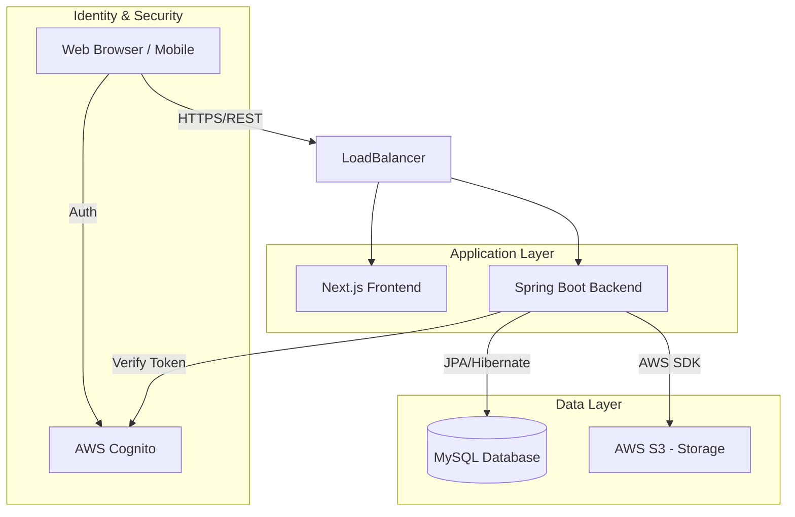

# System Architecture & Overview

## 1. Executive Summary

The **JPP (Job Portal Platform)** is a comprehensive recruitment and professional networking solution. It is designed to bridge the gap between job seekers, employers, and recruitment agents through a modern, scalable, and secure digital ecosystem. Beyond traditional job board features, it integrates social networking capabilities to foster professional connections.

## 2. Target Customers

The platform serves three primary distinct user personas:

1.  **Job Seekers**: Individuals looking for employment opportunities, wishing to showcase their professional profile, and networking with peers.
2.  **Employers**: Companies or organizations seeking to hire talent, post job vacancies, and manage the recruitment lifecycle.
3.  **Agents**: Recruitment agencies or authorized middlemen who facilitate the hiring process between employers and job seekers.

## 3. Core Use Cases

### For Job Seekers
*   **Profile Management**: Create and maintain a comprehensive professional profile (resume, skills, experience).
*   **Job Discovery**: Search and filter job vacancies based on various criteria.
*   **Application Tracking**: Apply for jobs and track the status of applications.
*   **Social Interaction**: Create posts, comment on industry updates, and network with other professionals.
*   **Interview Management**: View and manage scheduled interviews.

### For Employers
*   **Vacancy Management**: Create, update, and manage job postings.
*   **Candidate Management**: Review applications, shortlist candidates, and manage the hiring pipeline.
*   **Interview Scheduling**: Schedule and conduct interviews with candidates.
*   **Organization Profile**: Manage company branding and information.

### For Agents
*   **Talent Pool Management**: Manage a database of candidates.
*   **Recruitment Facilitation**: Act as an intermediary for specific job openings or employers.
*   **Document Management**: Handle necessary compliance and recruitment documents.

## 4. System Architecture

The system follows a modern **3-Tier Architecture** with a decoupled frontend and backend, leveraging cloud services for scalability and security.

### 4.1. High-Level Diagram

### 4.2. Component Description

#### **Frontend (User Interface)**
*   **Framework**: **Next.js** (React) with **TypeScript**.
*   **Styling**: **SASS** and **Bootstrap 5**.
*   **State Management & Data Fetching**: **SWR** / **Axios**.
*   **Key Features**: Server-Side Rendering (SSR) for SEO, Responsive Design, Rich Text Editing (Draft.js).

#### **Backend (API Layer)**
*   **Framework**: **Spring Boot 2.5.4** (Java 11).
*   **Build Tool**: Gradle.
*   **Security**: **Spring Security 5.5** (OAuth2 Resource Server with JWT).
*   **API Documentation**: **OpenAPI / Swagger UI**.
*   **Key Modules**:
    *   `user`: User profile core.
    *   `vacancy`: Job posting management.
    *   `interview`: Interview scheduling logic.
    *   `post`: Social feed management.

#### **Data Persistence**
*   **Database**: **MySQL 8.0**.
*   **ORM**: **Spring Data JPA** with **Hibernate**.
*   **Querying**: **QueryDSL** for complex type-safe queries.
*   **Schema Management**: `hibernate.ddl-auto` (currently set to update).

#### **Cloud & Infrastructure (AWS)**
*   **Authentication**: **AWS Cognito** (User Pools & Identity Pools) for secure identity management.
*   **Storage**: **AWS S3** for storing user resumes, profile pictures, and post media.
*   **Hosting**: Dockerized containers (Dockerfile present for both stack components).

## 5. Security Design

*   **Authentication**: Delegated to **AWS Cognito**. The frontend authenticates directly with Cognito to receive a JWT (JSON Web Token).
*   **Authorization**: The Spring Boot backend acts as an OAuth2 Resource Server. It validates the JWT signature against Cognito's keys (JWK) and enforces role-based access control (RBAC) on API endpoints.
*   **Data Protection**: HTTPS for data in transit; secure AWS storage for sensitive documents.

## 6. Development & Deployment

*   **Containerization**: Both Frontend and Backend are containerized using **Docker** and orchestrated via `docker-compose.yml` for local development.
*   **CI/CD**: Gradle for backend builds; Yarn for frontend builds.
*   **Configuration**: Externalized configuration via `application.yml` and environment variables, supporting multiple profiles (dev, prod, local).