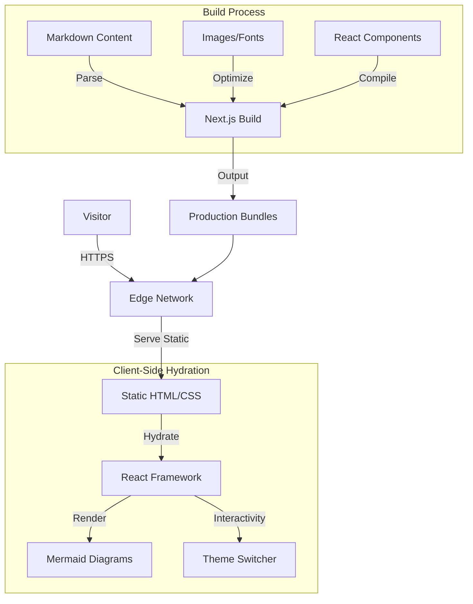

# System Architecture & Overview

## 1. Executive Summary

This project is a high-performance, responsive personal portfolio website designed to showcase professional experience, projects, and technical writings. It serves as a central hub for personal branding and professional networking. Built with **Next.js**, it leverages the latest React features like Server Components and the App Router for optimal performance and SEO.

## 2. Design Philosophy

The design focuses on:
*   **Minimalism & Clarity**: Clean typography and spacing to let the content breathe.
*   **Developer-First Aesthetic**: Dark mode by default, monospace fonts (`JetBrains Mono`), and tech-inspired visuals.
*   **Performance**: Zero layout shift, fast LCP, and static generation for instant loads.
*   **Accessibility**: High contrast ratios and semantic HTML structure.

## 3. Technical Stack

*   **Framework**: Next.js (App Router)
*   **Language**: TypeScript
*   **Styling**: Tailwind CSS, Tailwind Animate
*   **Icons**: Material Symbols Outlined, Lucide React
*   **Content Management**: Markdown-based (Static)
*   **Diagrams**: Mermaid.js (Client-side rendering)
*   **Deployment**: Vercel / Static Export

## 4. System Architecture

The site follows a **Static Site Generation (SSG)** architecture where possible, with client-side enhancements for interactivity.

## 5. Key Modules

### 5.1. Content Engine
A custom Markdown handling layer (`src/lib/content.ts`) reads from the file system. It uses `gray-matter` to parse frontmatter metadata (title, date, tags) and `remark`/`rehype` to transform markdown into React components. This allows for:
*   **Blog Posts**: Writing technical articles in Markdown.
*   **Projects**: Showcasing case studies (like this one).
*   **Rich Media**: Support for code highlighting and diagrams.

### 5.2. Component Architecture
The UI is built using atomic components for maximum reusability.
*   **Sidebar**: Persistent navigation with responsive state.
*   **Project Cards**: Detailed interactive cards for showcasing work.
*   **CodeBlock**: A custom component to render syntax-highlighted code with copy functionality.
*   **Mermaid**: A wrapper around `mermaid.js` to render architecture diagrams dynamically on the client.

## 6. Deployment & CI/CD

The project is configured for seamless deployment on platforms like Vercel or Netlify.
*   **Version Control**: Git
*   **CI**: GitHub Actions (linting, type checking)
*   **CD**: Automatic deployment on push to `main`.